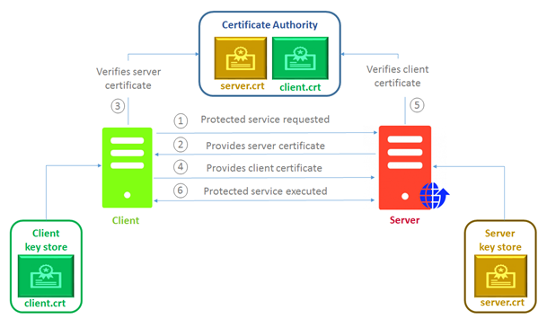

# Mutual TLS 

En esta ocasión vamos hacer un ejemplo de microservicio con mutual tls creando los certificados autofirmados.
 
 
 
 
Los pasos para generear los certificados de este ejemplo [pulsa aqui](mutual-tls-server/src/main/resources/Readme.md)
 
 El ejemplo de hoy es una aplicación que llama al api de github para obtener la información de un usuario. Lo que hacer es simular que github esta caído comprobar que nuestro circuit break funciona correctamente.
 
  
 
 - [x] Grizzly como servidor NIO
 - [x] Jersey como JAX-RS
 - [x] Jackson
 
 ## Requisitos
 
 * Maven 3 o superior
 * Java 11 o superior
 * Openssl
 
 ## Inicio rápido
 
 ```
 git clone git@github.com:xabe/mutual-tls.git
 ```
 
### Como usarlo

Comando para arrancar nuestro microservicio

````

mvn clean install -Pstart


````

Comando para invocar a nuestro endpoint

````
cd mutual-tls-server/src/main/resources/certs-client/

 curl -E ./file.crt.pem --key ./file.key.pem https://localhost:8443/v1/status -k
````